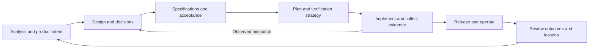

# Development lifecycle and document graph

Read this when choosing a development documentation workflow, tracing a change,
or helping an agent browse a mixed artifact set. See
[document types](document-types.md) for family-specific questions and
[legacy documents](legacy-documents.md) for preserving existing structures.
These conventions are available through `vault-lifecycle`; they do not enable
the still-proposed automated atlas and lifecycle features in the lifecycle PRD.

## Separate the questions a document answers

An artifact's family, lifecycle stage, approval, and implementation evidence are
independent. Preserve the project's existing metadata fields and values. Express
missing distinctions in its register or prose before introducing another schema.

| Dimension | Agent question | Example |
|---|---|---|
| Identity and family | Which artifact is this, and what question does it answer? | `API-001`, an interface contract |
| Scope | Which requirement, capability, boundary, or release does it cover? | Notification delivery, `FR-042` |
| Activity / stage | What work does it support? | Specify; later used to verify |
| Approval | Has the relevant owner approved this intent? | Draft, in review, accepted |
| Applicability / authority | Is it the current source for this concern? | Current or superseded, with replacement |
| Implementation | Does the described behavior exist? | Pending; merged at a named commit; deployed to a named environment |
| Verification | What was actually observed, and against which version? | Check, result, timestamp, revision, limitations |

`API-001` does not mean "the first API", "step one", or "approved". A specification
can be approved while implementation is pending. A historical result may accurately
verify an older version without proving the current release. A retrospective can
record an outcome without granting retroactive approval for scope or design.

## Use the lifecycle as a loop

This is a reading and change workflow, not a requirement to finish all documents
before learning from implementation. Iterate on the affected slice. Acceptance
criteria and test planning should shape design early; a spike can supply evidence
for a proposed ADR without making the proposed design approved production behavior.

| Activity | Useful output when triggered | Handoff to the next activity |
|---|---|---|
| Discover / analyze | Evidence, problem framing, PRD requirements | Named user outcome, scope, assumptions, measurable success |
| Design / decide | Proposed design, alternatives, ADR, architecture views | Boundaries and rationale; unresolved choices have owners |
| Specify | Data/API/security/quality contracts | Testable obligations, edge cases, failure behavior, acceptance |
| Plan | Work sequence, test strategy, migration or cutover plan | Owners, dependencies, verification, rollback, exit evidence |
| Implement | Code, tests, PR/change record, observed checks | Requirement and contract coverage at a known revision |
| Release / operate | Release evidence, runbooks, monitoring, recovery | Known deployed version, operational ownership and procedures |
| Review / improve | Retro or incident review, corrective work | Expected vs observed outcomes, causes, decisions, follow-up |

Not every feature needs a separate artifact at each row. One design document may
contain its specification and plan if their roles remain clear. A small change can
use an existing requirement, a PR, and relevant verification. Split documents when
ownership, review cadence, audience, or reusable contracts differ.

## Give each graph edge a meaning

Keep existing graph fields if the project has them. Otherwise an adjacency table
in the existing register or labeled links in the owning document is enough. The
following labels are document-level meanings, **not new vault `rel_*` fields**:

| Edge, from -> to | Meaning | Example |
|---|---|---|
| informed-by | A claim or choice used this evidence, within its limits | ADR -> analysis observation |
| decides | A decision constrains this concern or artifact | ADR -> interface contract |
| specifies | A contract defines obligations for this requirement | API/DAT/QAT/SEC -> PRD requirement |
| depends-on | This work or contract requires the named dependency | Migration plan -> data contract |
| plans | A plan schedules implementation or verification work | Delivery plan -> work item |
| implements | A concrete change implements this obligation | PR/commit -> specification requirement |
| verifies | An observed result checks this obligation at a named revision | Test-run evidence -> acceptance criterion |
| operates | A procedure or signal applies to this implemented surface | Runbook -> deployed service/release |
| reviews | A review assesses this bounded change or outcome | Retro -> release evidence |
| supersedes | This replacement explicitly replaces the named earlier scope | New decision -> earlier decision |

For each edge identify the actual endpoints and relevant scope: requirement/section,
version, or observation date. Do not attach a whole PRD as a vague source when only
one requirement is implicated. Test strategy **plans** verification; executed test
evidence **verifies**. A proposed plan does not **implement** its specifications.
Keep the actual result (`pass`, `fail`, `skipped`, or `blocked`) on an evidence
edge. The existence of that edge alone does not mean the obligation passed.

A synthetic example, with paths linked when corresponding artifacts exist:

| From | Relationship | To | Scope / evidence |
|---|---|---|---|
| API-001 | specifies | PRD-001 / FR-042 | Delivery attempts stop after three tries |
| ADR-0003 | decides | API-001 | Queue-based delivery boundary |
| TST-001 | plans | Existing test work item | Retry exhaustion and replay behavior |
| Implementation PR | implements | API-001 / retry rule | Commit and relevant code path |
| Observed run | verifies | API-001 / retry rule | Actual result at that commit; environment named |
| RET-001 | reviews | Released change | Expected vs observed delivery outcomes |

Rows describe a shape, not fictional successful evidence. Fill them from real
artifacts or leave pending work in a planned-artifact/work table. Keep relationship
ownership in one maintained location; derive reverse traversal from those edges
rather than maintaining two potentially conflicting directions. A bare
"related documents" list is useful navigation but cannot establish causality.

For typed nodes, keep the existing meanings: `sources` cites source artifacts,
`code_refs` locates code, and `rel_*` targets existing vault node IDs. Do not encode
document-level edges as unsupported `rel_implements` or `rel_verifies` keys, or
put external document IDs into typed relations. Keep them in the project's register,
source document, or existing graph schema. The maintenance helper checks targets,
not these relationship semantics, approval, coverage, or result validity.

## Build a short route for the agent

Use the existing project portal as the entry point. Its register row needs enough
information to decide whether to open a body: ID, family/title, one-sentence scope,
canonical location, authority/state, and unresolved evidence or next action when
relevant. A synopsis should distinguish two analyses such as `ANA-004` and
`ANA-005`; a number alone cannot identify their subjects.

| Agent task | Reading route |
|---|---|
| Understand product scope | Portal -> relevant PRD requirements -> source evidence/open decisions |
| Implement a behavior | Requirement -> governing ADR -> relevant DAT/API/QAT/SEC sections -> work/test plan |
| Change a schema or interface | Contract -> deciding ADR -> dependent APIs/migrations -> impacted code/tests/operations |
| Verify release readiness | Requirement -> acceptance criterion -> executed evidence -> deployed revision/operations |
| Diagnose a failure | Observed failure -> implemented code/contract -> governing decision -> prior incident/retro |
| Learn from a milestone | Outcome evidence -> retrospective -> corrective work or proposed decision |

Start with one entry point and one relevant sub-index. Read summaries before bodies
and follow roughly three hops before narrowing again. Filter by task, capability,
authority, and family, not just folder or date. Search when the curated route fails,
then repair the relevant pointer if documentation changes are authorized.
For impact and supersession walks, keep a visited set. Report a cycle or conflicting
canonical owners rather than choosing the newest document or looping indefinitely.

Distinguish **planned** from **present** in the register. A planned `DAT-006` can
have an owner, purpose, and exit question without a file link or stub document.
When a user supplies an unregistered ID, report it as unresolved; do not assign
its subject from a nearby number. Create the artifact only when requested and
its intended role is sufficiently clear.

## Review the affected graph when something changes

- A requirement change prompts review of its decisions, contracts, implementation,
  verification, and release obligations. Preserve IDs according to the project's
  revision policy; do not silently redefine a requirement or reuse a retired ID.
- A decision or contract change prompts review of dependents and evidence at the
  previous revision. Do not automatically mark dependents invalid: record what
  changed and which specific claims need review.
- An implementation change prompts review of as-built views, tests, and operating
  procedures. Record observed deployment separately from merging code.
- A new observation or retro can propose changes to a PRD or ADR. It cannot silently
  overwrite approved intent or make historical evidence describe today's system.

Update the affected canonical artifacts, relationship rows, and existing work
tracker together. Preserve original observations; use an addendum or explicit
supersession where needed. Verify changed targets, material claims, and the checker
actually invoked. Record the revision and output behind a verification claim.

The completion condition is a useful path from the changed requirement or concern
to current intent, relevant implementation, and available evidence, with remaining
gaps owned and visible. A fully populated catalog or a graph with many edges is
not evidence of coverage.
