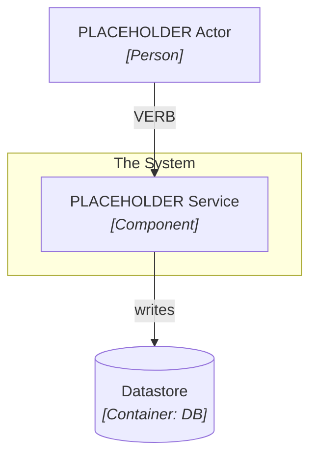

## Runtime View

<!-- Narrative: step-by-step trace of a representative happy-path execution, naming the actors, modules, and data contracts at each hop. Keep to one or two paragraphs. -->

## Trigger and Preconditions

<!-- What initiates this flow? What must be true before it can run? -->

## Happy Path Steps

<!-- Ordered list of the main steps. Each step names the module and data contract involved. -->

## Error Paths and Edge Cases

<!-- Known failure modes, retry behavior, partial-completion states. -->

## Invariants and Governance

<!-- Link the invariant nodes this flow must respect. E.g.: governed by [[invariant-PLACEHOLDER]]. -->
