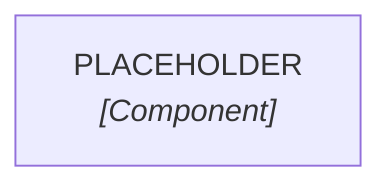

## Purpose and Responsibilities

<!-- What problem does this module solve? What is it responsible for, and not responsible for? -->

## Interfaces

<!-- Entry points: API routes, exported functions, events emitted/consumed, auth hooks, DB models touched. Use `code_refs` for anchors. -->

## Runtime

<!-- Link to the flow nodes that cross this module. E.g.: see [[flow-PLACEHOLDER]]. -->

## Crosscutting Concerns

<!-- Auth, observability, error-handling patterns, background workers. -->

## Quality and Constraints

<!-- Performance budgets, rate limits, known scaling limits, SLAs if any. -->

## Risks and Tech Debt

<!-- Known fragility, deferred work, migration hazards. -->
